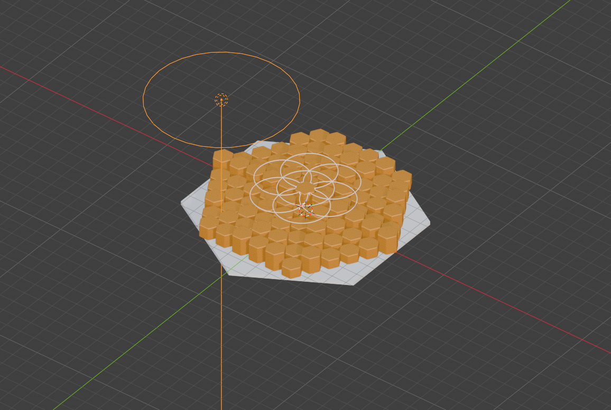
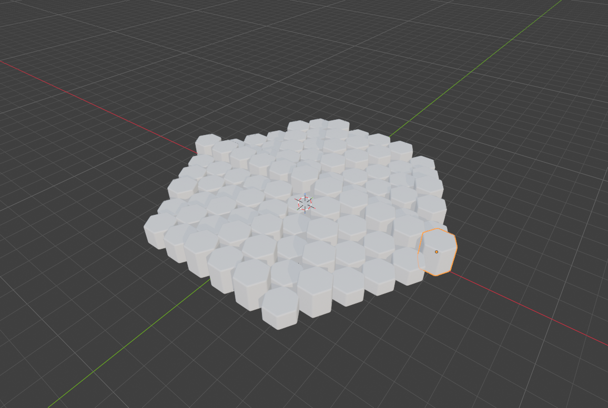
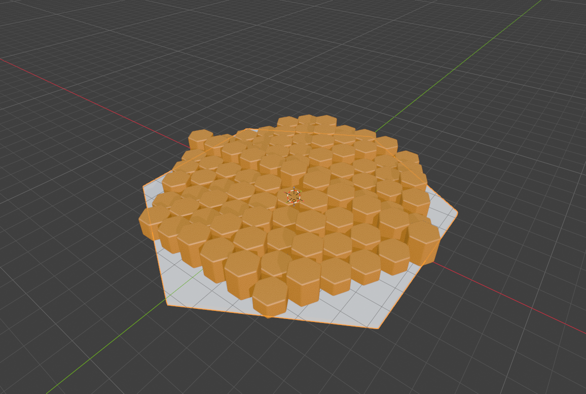

# hive-blender

An agent can inspect a Blender scene, capture its viewport, and run guarded Blender commands through hive's loopback tool.



## What it looks like

This is a live Blender 5.2 Flatpak run, not a mock render. [Follow the calls and exports](docs/showcase/README.md).

| View | Call that produced it |
| --- | --- |
|  | Confirmed `execute_code` calls built six rings of hexagonal slabs; `get_viewport_screenshot` captured the result. |
|  | Confirmed `execute_code` added amber material and a basalt ground; `get_viewport_screenshot` captured the result. |
|  | Confirmed `execute_code` added seven rings and a central hexagon; `get_viewport_screenshot` captured the result. |
|  | Confirmed `execute_code` placed the camera and light; `get_viewport_screenshot` captured the viewport. |

## Try it

Install and enable the reference Blender MCP `addon.py` in a GUI Blender instance on the same host. Set `BLENDERMCP_NO_UPDATE_CHECK=1` in Blender's environment before starting it. Its loopback listener uses port 9876 by default. Put this entry under `:addons` in hive-mcp's `config.edn`:

```clojure
{:addons {"hive.blender"
          {:port 9876
           :code-gate {:max-bytes 200000
                       :deny-substrings ["import os" "subprocess" "requests" "urllib"
                                         "premium" "telemetry" "polyhaven" "sketchfab"
                                         "hyper3d" "tripo" "open("]
                       :require-confirm true}}}}
```

Inspect the scene with the `blender` tool:

```json
{"command":"call","id":"get_scene_info","params":{}}
```

For code execution, use `"id":"execute_code"`, put Python in `"params":{"code":"..."}`, and add `"confirm":true`. CodeGate approval is required; this is not a Python sandbox.

## Measured

In the live Blender 5.2 run, `get_scene_info` returned **102 objects**. A CodeGate-confirmed `execute_code` exported **91 selected slabs** with `bpy.ops.wm.stl_export(..., export_selected_objects=True, apply_modifiers=True, global_scale=10.0)`. The resulting [STL](docs/showcase/hive-geometry-slab-130mm.stl) is about **130 mm** across. Without that source export scale, Blender units exported at about **13 mm**. The scaled STL was then sliced through hive-bambu: **15.1 s** wall time, **3.14 MB** `.gcode.3mf`, **9822 s** (2 h 44 min) estimated print time, **19.4 m** filament. These are measurements of this run, not general performance claims.

## Running

Install and enable the reference Blender MCP `addon.py` in a **GUI** Blender instance, on the
same host as hive-blender. Set `BLENDERMCP_NO_UPDATE_CHECK=1` **in Blender's environment** before
launching to disable the add-on's network update check. The direct socket path never imports
its Python MCP server; hive-blender makes no telemetry, update, Premium or cloud provider calls.
Do not enable optional provider integrations in the baseline. Automated tests use an
in-process fake add-on server; the showcase above records a separate live Blender 5.2 run.
Restrict access to the loopback listener: the reference add-on has no socket
authentication and other local processes can send it commands directly.

Configure the addon in hive-mcp's `config.edn` under `:addons`:

```clojure
{:addons {"hive.blender"
          {:port 9876
           :code-gate {:max-bytes 200000
                       :deny-substrings ["import os" "subprocess" "requests" "urllib"
                                         "premium" "telemetry" "polyhaven" "sketchfab"
                                         "hyper3d" "tripo" "open("]
                       :require-confirm true}}}}
```

The addon refuses to mount without a valid `:code-gate`. Alternatively, a host can inject a
`hive-blender.port/CodeGate` record under that key. The data policy requires a positive
`:max-bytes` of at most 200000 UTF-8 bytes, a nonempty case-insensitive substring deny-list,
and `:require-confirm true`; it cannot accept regular expressions or executable policy code.
`execute_code` always requires `:confirm true` and gate approval. The gate is a policy
hook, not a Python sandbox. On socket timeout the typed `:blender/unknown-outcome` means a
mutation might already have run; never replay it automatically. Every call uses a fresh socket,
closed after reply or error, one outstanding command per socket. Configure socket time/size
bounds via `socket-link`; the destination is hardwired to IPv4 loopback, default port 9876.

The tool offers `catalog`, `doctor`, `call` and `export_stl`; optional provider handlers are not catalogued.

## Blender → Bambu hand-off

Use two tool calls, with no dependency between the addons:

1. `blender` with `{"command":"export_stl","params":{"path":"$HOME/models/cube.stl","objects":"selected"}}` (replace `$HOME` with your absolute home path before calling the tool). Choose a **new** path under your home directory (not `/tmp`); `objects` may be `selected`, `all`, or an array of object names/name prefixes. By default the exporter scales Blender metres-as-units by 1000 into millimetres. Specify `scale` (positive, at most 1000) or `target-mm` (positive largest bounding-box dimension), never both. It executes through the mandatory CodeGate with confirmation, verifies the binary STL and returns a ModelArtifact with `path`, `format`, `sha256`, `bytes`, `units`, `mm`, `bbox-mm` and `provenance`.
2. `bambu` with `{"command":"slice","model":{"path":"$HOME/models/cube.stl","format":"stl","sha256":"<returned sha256>","bytes":<returned bytes>},"preset":{"printer":"<printer>","process":"<process>","filament":"<filament>"}}`. Supply the four shared keys from the artifact (the slicer re-fingerprints the file); choose your actual installed preset names. This does **not** print: upload/print still requires the independent PrintGate.

The Bambu `ModelArtifact` schema is an open Malli map; its slicer fingerprint check currently compares the full map against its own four-key projection, so pass only those four keys to `slice`, not the extra Blender metadata. An export timeout after dispatch is `:blender/unknown-outcome`: inspect the destination manually; never retry automatically.
Scene and object references are values containing file identity and names, not `bpy` pointers.
See [native seams](docs/native-seams.md) for deployment limits and unanswered questions.

Run `clojure -M:test` and `dev/verify_portability.sh` for the fake-server conformance and
JVM/cljw/cljrs/cljs portable codec checks. The GPL bambu-printer-mcp bridge is used for
interoperability facts only; redistributing or requiring it from an MIT addon needs a separate
licensing decision.

License: MIT.
