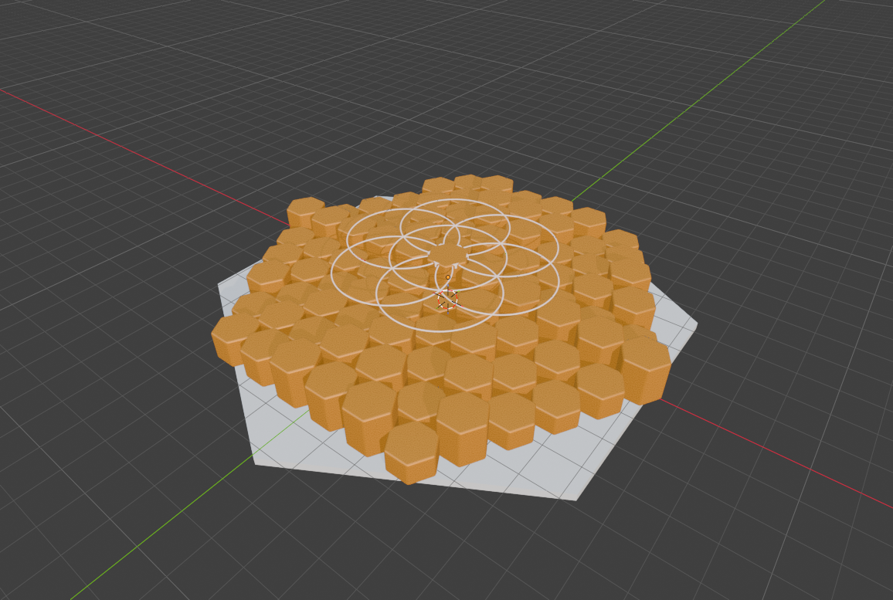

# From Blender viewport to printable slab

This sequence was captured from a live Blender 5.2 Flatpak GUI through hive-blender 0.1.1. The add-on spoke over the local Blender MCP socket. The run used the base catalog and a CodeGate with explicit confirmation for `execute_code`; it did not call optional provider services. [Start with the tool setup](../../README.md#try-it).

## Build and inspect

1. `blender` with `{"command":"call","id":"get_scene_info","params":{}}` inspected the scene. The measured response in the later export run reported **102 objects**.
2. Confirmed `execute_code` calls cleared the scene and built **91 beveled hexagonal slab meshes** in six rings. A `get_viewport_screenshot` call wrote [stage 1](stage-1.png).
3. Confirmed `execute_code` assigned amber material to the slabs and made a dark ground. `get_viewport_screenshot` wrote [stage 2](stage-2.png).
4. Confirmed `execute_code` added seven thin Flower-of-Life rings and a central solar hexagon. `get_viewport_screenshot` wrote [stage 3](stage-3.png).
5. Confirmed `execute_code` added an orthographic camera and area light and selected material-preview shading. `get_viewport_screenshot` wrote [stage 4](stage-4.png).
6. `export_scene` wrote a GLB during the staged run. A separately confirmed `execute_code` selected only the slabs and ran Blender's STL exporter. `get_viewport_screenshot` wrote [stage 5](stage-5.png). The later scaled export produced [the 130 mm slab STL](hive-geometry-slab-130mm.stl).

| Geometry | Material | Rings | Camera | Export stage |
| --- | --- | --- | --- | --- |
|  |  |  |  |  |

The staged run's driver and its transport notes are in [`dev/live`](../../dev/live/README.md). In that run, one screenshot request timed out after dispatch; the screenshot file arrived later. It was not replayed. A timeout after dispatch does not prove that Blender skipped the operation.

## Scale at the source

The built-in `export_scene` covers GLB and FBX, not STL. For the printable file, an authorized `execute_code` used Blender's STL exporter with selected objects and applied modifiers:

```python
bpy.ops.wm.stl_export(filepath=".../hive-geometry-slab-130mm.stl",
                      export_selected_objects=True,
                      apply_modifiers=True,
                      global_scale=10.0)
```

The default-scale slab exported at about **13 mm**. Applying `global_scale=10.0` at export yielded about **130 mm**. The selected set had **91 slabs**. The STL here is **729 KB**. CodeGate confirmation controls access to `execute_code`; it does not sandbox Python. Inspect and approve code before sending it.

## The craft pipeline

This slab shows a concrete Blender-to-Bambu handoff. hive-blender produced the scaled STL; hive-bambu's Flatpak CLI slicer used BambuStudio 2.8.2.61 with X1 Carbon 0.4 nozzle, 0.20mm Standard, and Bambu PLA Basic profiles. The measured slice took **15.1 s** wall time and produced a **3.14 MB** `.gcode.3mf`. It estimated **9822 s** (2 h 44 min) printing and **19.4 m** of filament. Slicing is not printing: hive-bambu refuses a print unless its configured `:print-gate` permits it.

PhotoCraft and VectorCraft are the art side of the same cross-craft showcase: PhotoCraft staged the "hive geometry" artwork through its control port, and VectorCraft drew a golden-comb composition through its control channel. They are separate artwork runs, not steps that generated this STL. The Blender mesh feeds the Bambu slicer; the artwork shows the visual exploration around it.
